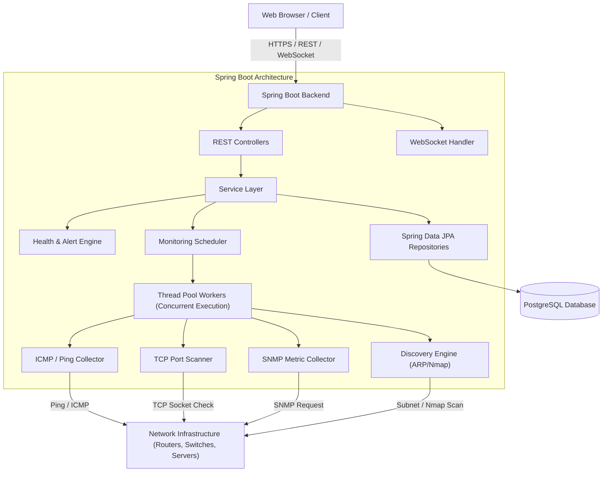
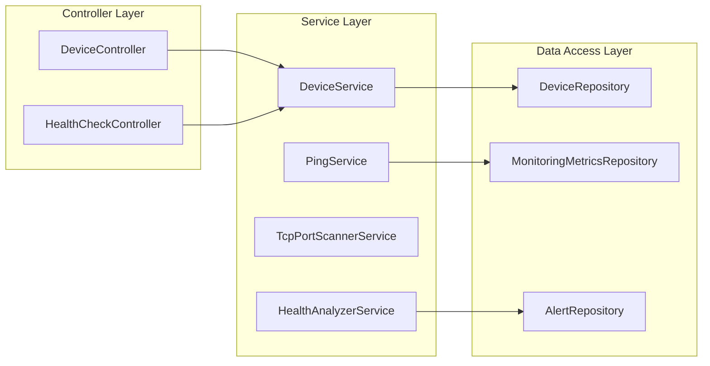
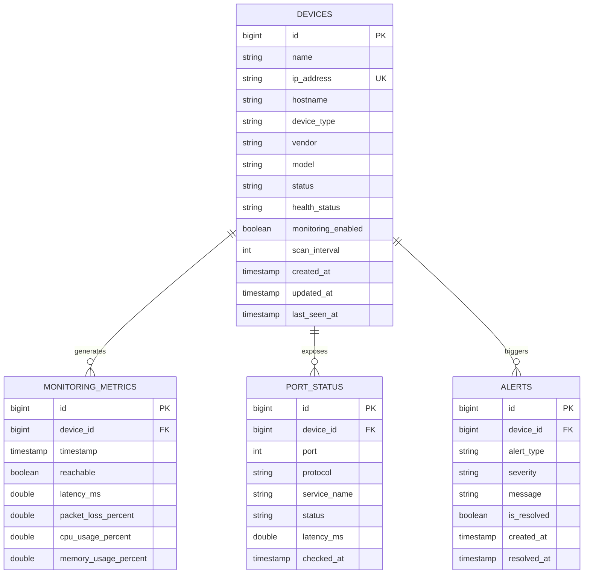

# Architecture & System Design — Network Device Monitoring System

## 1. Project Overview

The **Network Device Monitoring System** is an enterprise-grade backend and web application designed to continuously monitor, discover, analyze, and alert on network infrastructure devices (routers, switches, servers, printers, firewalls, and workstations).

### Core Functional Capabilities
- **Automated Network Discovery**: Network range scanning via ICMP Ping, ARP, TCP port scanning, and Nmap.
- **Continuous Real-Time Monitoring**: Periodic status & metric polling (Ping reachability, TCP port availability, latency measurement, SNMP device hardware metrics).
- **Health Engine & Alerting**: Dynamic threshold evaluation, state change detection (`HEALTHY`, `WARNING`, `CRITICAL`, `OFFLINE`), and multi-channel notifications.
- **Real-Time Web Dashboard**: Interactive updates via WebSockets, responsive visual dashboard, and device management.
- **Historical Reporting & Analytics**: Historical metric storage, availability graphs, and automated performance summaries.

---

## 2. Technology Stack

| Layer | Technology | Details / Role |
|---|---|---|
| **Backend Framework** | Java 21+ / Spring Boot 3.x | Core application logic, REST endpoints, scheduling, & network monitoring |
| **Database** | PostgreSQL 16+ | Relational metric, alert, user, and device repository |
| **Persistence** | Spring Data JPA / Hibernate | Object-Relational Mapping & transactional management |
| **Validation** | Spring Validation (Jakarta Validation) | DTO input verification & constraints |
| **Build & Dependency** | Apache Maven 3.9+ | Package lifecycle & dependency management |
| **Network Interfaces** | `java.net`, `SNMP4J`, `Nmap` | Native ICMP/Ping, TCP Socket, SNMP v2c/v3 polling |
| **Real-time Engine** | Spring WebSocket (STOMP / SockJS) | Sub-second event dispatching to frontend clients |
| **Security (Phase 13)** | Spring Security + JWT | Role-Based Access Control (`ADMIN`, `OPERATOR`, `VIEWER`) |
| **Frontend (Phase 9)** | React + TypeScript + Vanilla CSS | Web UI Dashboard & administrative panels |
| **Containerization** | Docker & Docker Compose | Multi-container environment orchestration |

---

## 3. High-Level Architecture

---

## 4. Component Hierarchy

---

## 5. Database ER Diagram

---

## 6. Implementation Milestones

1. **Phase 0 & 1** (Current): Requirements, Architecture, Spring Boot setup, PostgreSQL connection, and core `Device` entity.
2. **Phase 2**: Device Management APIs (CRUD operations & IP validation).
3. **Phase 3**: Real Ping/ICMP Monitoring module & metric storage.
4. **Phase 4**: TCP Port Monitoring & service reachability.
5. **Phase 5 & 6**: Automatic Subnet Network Discovery & Nmap integration.
6. **Phase 7 & 8**: Bounded Scheduler, Worker Pool, Health Engine, & State-change Alerting.

7. **Phase 9 & 10**: React Dashboard UI & WebSockets.
8. **Phase 11 — 17**: SNMP Metrics, Security, Reports, Dockerization, & Verification.
