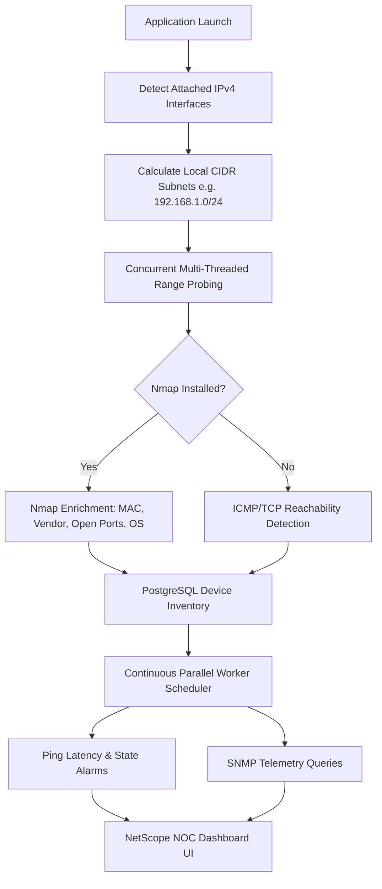

# NetScope — Enterprise Network Discovery & Monitoring


**NetScope** is a high-performance enterprise network discovery and telemetry monitoring platform built with Java 21 and Spring Boot. It dynamically detects IPv4 network interfaces, probes subnet ranges, auto-imports active hosts into PostgreSQL, monitors device reachability with parallel thread workers, and delivers real-time telemetry through a dark NOC operational dashboard.

---

## 🌟 Key Features

### 🖥️ Enterprise NOC Operational Dashboard
- **Dark NOC Design System**: Visual hierarchy optimized for 1366×768, 1080p, and mobile/tablet screens with persistent sidebar navigation and sticky telemetry bar.
- **KPI Metrics**: Real-time tracking of Total Devices, Online reachability ratio, Offline alert counts, and Average Latency.
- **Discovered Devices Map**: Visual node graph distinguishing network gateways/routers from active hosts with status indicators and quick inspection drawers.
- **Slide-in Device Details Drawer**: Inspect MAC addresses, vendor identification (OUI), latency history, open ports, SNMP telemetry, and run host probes on demand.

### 🔍 Automated & Manual Subnet Discovery
- **Local Interface Auto-Detection**: Probes attached network adapters (`wlan0`, `eth0`, etc.) and automatically calculates their subnets (e.g. `192.168.1.0/24`).
- **Multi-Threaded Subnet Scanner**: Concurrent CIDR range scanner supporting ICMP Ping, TCP Port Probes, and Nmap engine scans.
- **Selective Host Import**: Select newly discovered network endpoints and import them directly into active monitoring inventory.

### 📊 Deep Telemetry & Monitoring Engine
- **Parallel Worker Scheduler**: Background thread pool executing ping checks every 10 seconds across registered inventory.
- **Nmap & SNMP Integration**: Deep enrichment including MAC address, vendor identification, open TCP ports, service versions, OS hints, and SNMP v2c/v3 metrics (CPU, RAM, Uptime).
- **Strict Real Data Integrity**: Zero fake data or random values. Unavailable measurements report `N/A` rather than fabricating statistics.

### ⚠ Alert Center & Reports
- **State Change Detection**: Automatic alarm creation when endpoints transition between `ONLINE` and `OFFLINE` states.
- **CSV Inventory Export**: Instant export of registered device details, MACs, vendors, and health status for network audit compliance.

---

## 🏗️ Architecture & Discovery Pipeline



---

## 🛠️ Technology Stack

- **Backend Framework**: Java 21, Spring Boot 3.4.2 (Spring Data JPA, Hibernate, Web, WebSocket/STOMP)
- **Database**: PostgreSQL 16 (H2 for unit testing)
- **Network Probes**: ICMP Native Probes, TCP Socket Probes, Nmap Engine, SNMP4J
- **Frontend Architecture**: Vanilla HTML5, CSS3 Custom Properties (NOC Theme), ES6+ JavaScript SPA (Served directly via Spring Boot)
- **Containerization**: Docker & Docker Compose (Host Networking enabled for Linux L2 MAC detection)

---

## 🔌 REST API Reference

### Network Discovery

| Method | Endpoint | Description |
|---|---|---|
| `GET` | `/api/discovery/local-networks` | Returns attached local IPv4 interfaces & subnets |
| `POST` | `/api/discovery/auto` | Executes automatic discovery on attached subnets |
| `GET` | `/api/discovery/auto/status` | Checks background auto-discovery status |
| `POST` | `/api/discovery/scan` | Scans a specific CIDR range (ICMP / TCP) |
| `POST` | `/api/discovery/import` | Imports selected discovered hosts into inventory |
| `GET` | `/api/discovery/nmap/status` | Checks Nmap binary availability on host |
| `POST` | `/api/discovery/nmap` | Triggers an Nmap subnet scan |

### Device Management & Probes

| Method | Endpoint | Description |
|---|---|---|
| `GET` | `/api/devices` | Returns device inventory (supports `search`, `type`, `status` filters) |
| `GET` | `/api/devices/{id}` | Returns detailed device metadata |
| `POST` | `/api/devices` | Registers a new device manually |
| `PUT` | `/api/devices/{id}` | Updates existing device parameters |
| `PATCH` | `/api/devices/{id}/toggle-monitoring` | Enables or disables background monitoring |
| `DELETE` | `/api/devices/{id}` | Removes a device from monitoring |
| `POST` | `/api/devices/{id}/check` | Triggers an instant ICMP ping probe |
| `GET` | `/api/devices/{id}/metrics` | Returns ping latency history |
| `GET` | `/api/devices/{id}/events` | Returns recent device state change events |
| `POST` | `/api/devices/{id}/scan-ports` | Performs a TCP port scan |
| `GET` | `/api/devices/{id}/ports` | Returns discovered open ports |
| `POST` | `/api/devices/{id}/snmp-check` | Queries SNMP v2c/v3 telemetry |
| `GET` | `/api/devices/{id}/snmp` | Returns cached SNMP metrics |

### History, Alerts & Reports

| Method | Endpoint | Description |
|---|---|---|
| `GET` | `/api/history/device/{id}` | Historical metric trends for a device |
| `GET` | `/api/events` | Recent system-wide network events |
| `GET` | `/api/alerts` | Active and resolved alert history |
| `PATCH` | `/api/alerts/{id}/resolve` | Resolves an active alert |
| `GET` | `/api/reports/summary` | System SLA and reachability summary report |
| `GET` | `/api/reports/export/csv` | Downloads `device_inventory_report.csv` |

---

## 🚀 Getting Started

### Prerequisites
- **JDK 21** or later
- **PostgreSQL 16** (or Docker)
- **Nmap** (Optional, recommended for MAC vendor & port scanning)
- **Maven 3.9+**

### Local Development Setup

1. **Clone the repository**:
   ```bash
   git clone https://github.com/KiShOrE-2008/Network-Analyser.git
   cd Network-Analyser
   ```

2. **Run Maven unit tests**:
   ```bash
   ./mvnw clean test
   ```

3. **Start the application**:
   ```bash
   ./mvnw spring-boot:run
   ```

4. **Access the NetScope Dashboard**:
   Open [http://localhost:8080](http://localhost:8080) in your browser.

---

## 🐳 Docker Deployment

For real LAN discovery on Linux, NetScope uses host network mode so the container can probe actual local L2/L3 devices.

```bash
# Build and start services in background
docker compose up --build -d

# View application logs
docker compose logs -f app

# Stop containers
docker compose down
```

---

## ⚙️ Configuration Reference

Environment variables can be specified in `.env` or passed directly to Docker:

| Environment Variable | Default Value | Description |
|---|---|---|
| `SPRING_DATASOURCE_URL` | `jdbc:postgresql://localhost:5433/myapp` | PostgreSQL JDBC Connection URL |
| `DB_USERNAME` | `kishore` | PostgreSQL Database User |
| `DB_PASSWORD` | `postgres` | PostgreSQL Database Password |
| `SPRING_JPA_HIBERNATE_DDL_AUTO` | `update` | DDL generation strategy (`update` / `validate`) |
| `DISCOVERY_INITIAL_DELAY` | `10000` | Initial discovery scan delay (ms) |
| `DISCOVERY_INTERVAL` | `60000` | Subnet auto-discovery interval (ms) |
| `MONITORING_INTERVAL` | `10000` | Reachability monitoring worker cycle (ms) |

---

## 🧪 Verification & Quality Control

The project includes automated JUnit 5 and Spring Boot integration tests:

```bash
./mvnw test
```

All 58 unit tests cover API controllers, network discovery services, health analyzers, scheduler thread pools, and report generators.

---

## 📄 License

This project is open-source under the [MIT License](LICENSE).
