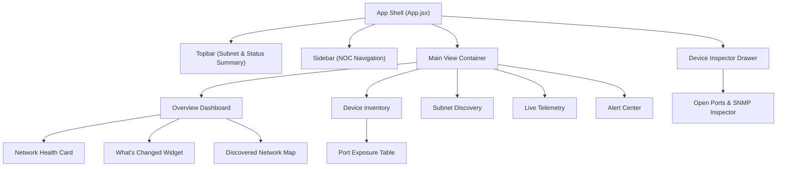

# NetScope UI — NOC Dashboard & UI Development Specification

This document provides the definitive design and implementation specification for building and extending the **NetScope** lightweight Network Operations Center (NOC) web application.

---

## 1. UI Vision & Design Philosophy

> **Dark • Technical • Clean • Information-Dense • Live**

NetScope is designed as an operational, enterprise-grade NOC terminal. It prioritizes immediate situational awareness, restrained professional contrast, and high data density without generic CRUD styling or excessive cyberpunk glow.

### Key Visual & Functional Principles

- **Discover → Identify → Monitor → Detect Changes → Investigate**: The UI guides operators through the complete network lifecycle.
- **Hero Feature Prominence**:
  - **Discovered Network Map**: Visual representation of active network endpoints.
  - **What's Changed? Card**: Instant callout for new host joins, port exposures, and identity shifts.
  - **Port Exposure Inspector**: Specific focus on newly exposed TCP/UDP service ports.
- **Restrained NOC Palette**: `#070A12` dark backdrop, `#0F172A` glass card containers, and strict status colors (Emerald Green, Amber Yellow, Rose Red).
- **Dual Typography System**:
  - **Inter**: Primary UI labels, headers, and navigation text.
  - **JetBrains Mono**: All technical data including IP addresses, MAC addresses, port numbers, timestamps, and latency values (`ms`).

---

## 2. Global Application Shell

All pages share a unified 3-part layout shell: `Sidebar` + `Topbar` + `Main View Content`.

```text
┌──────────────────────────────────────────────────────────────────────────────┐
│  NETSCOPE       Network: Wi-Fi     ● SYSTEM HEALTHY    🔍 Search    ⚙  👤 │
├──────────────┬───────────────────────────────────────────────────────────────┤
│              │                                                               │
│  ⌂ Overview  │   NETWORK OVERVIEW                                            │
│              │                                                               │
│  ◉ Devices   │   ┌─────────┐ ┌─────────┐ ┌─────────┐ ┌─────────────┐       │
│              │   │  24     │ │  21     │ │  3      │ │  12.4 ms    │       │
│  ⌁ Discovery │   │ Devices │ │ Online  │ │ Offline │ │ Avg Latency │       │
│              │   └─────────┘ └─────────┘ └─────────┘ └─────────────┘       │
│  ◌ Monitor   │                                                               │
│              │   ┌────────────────────────────┐ ┌─────────────────────────┐ │
│  ⚠ Alerts    │   │ DISCOVERED NETWORK MAP     │ │ WHAT'S CHANGED          │ │
│              │   │  ● Router                  │ │ + 2 New Devices         │ │
│  ▣ Reports   │   │  ├── ● Server (192.168.1.1)│ │ + 1 Port Exposed (8080) │ │
│              │   │  └── ● Laptop (192.168.1.5)│ │ ● 1 Device Came Online  │ │
│  ⚙ Settings  │   └────────────────────────────┘ └─────────────────────────┘ │
└──────────────┴───────────────────────────────────────────────────────────────┘
```

### Topbar Component (`Topbar.jsx`)

- **Left**: Branding logo + Active Subnet Selector (e.g. `Wi-Fi • 192.168.1.0/24`).
- **Center**: System Status Badge (`● 21 Online` / `⚠ 3 Alerts` / `↻ Last scan 12s ago`).
- **Right**: Global Search input (`Ctrl + K`), Settings modal trigger, User Profile badge.

### Sidebar Navigation (`Sidebar.jsx`)

- Compact, fixed-width vertical navigation:
  - `⌂ Overview` — Master NOC Operations Dashboard
  - `◉ Devices` — Device Inventory Data Table
  - `⌁ Discovery` — Subnet Auto-Detector & Scanner
  - `◌ Monitoring` — Real-Time Telemetry & SNMP Meters
  - `⚠ Alerts` — Active Alarm Feed & Event History
  - `▣ Reports` — SLA Compliance & CSV Exporter
  - `⚙ Settings` — System & Scan Parameters

---

## 3. Hero Views & Component Specifications



### 1. NOC Operational Dashboard (`OverviewView.jsx`)

#### A. KPI Metrics Row

- **Total Devices**: Count of registered host endpoints.
- **Availability / Online Ratio**: Percentage & online/offline breakdown (`21 Online / 3 Offline`).
- **Average Latency**: Network-wide response speed (`12.4 ms`).
- **Active Alerts**: Critical and warning alarm count (`04 Active`).

#### B. Network Health Gauge Card

- Aggregated operational rating (0–100 score):
  - **Availability Signal**: 94%
  - **Latency Signal**: 88%
  - **Packet Loss Signal**: 99%
  - **Device State Signal**: 82%

#### C. What's Changed Widget

- Highlights real-time network state changes:
  - `+ 2 New Devices Discovered`
  - `⚠ New TCP Port Exposed (192.168.1.15:8080 HTTP Proxy)`
  - `● 1 Host Reconnected`
  - `🔴 1 Host Disconnected`

#### D. Discovered Network Map Component

- Interactive visual node graph displaying network topology:
  - Gateway / Router at top (`192.168.1.1`)
  - Subnet branches connected to Switches, Servers, Workstations, APs, and IoT endpoints.
  - Pulsing status dots (`🟢 Online` / `🔴 Offline`).
  - Click node -> Opens slide-in **Device Inspector Drawer**.

---

### 2. Device Inventory (`DevicesView.jsx`)

High-density data table supporting fast inline searching and multi-attribute filtering.

```text
DEVICES INVENTORY                                   [ + ADD DEVICE ]
────────────────────────────────────────────────────────────────────
🔍 Search IP, Hostname, MAC address...
[ Filter by Type ▾ ]  [ Status: All ▾ ]  [ Monitoring: Enabled ▾ ]

┌───┬──────────────┬───────────────┬────────────┬─────────┬───────────┐
│●  │ Device Name  │ IP Address    │ Type       │ Latency │ Last Seen │
├───┼──────────────┼───────────────┼────────────┼─────────┼───────────┤
│🟢 │ Gateway-01   │ 192.168.1.1   │ ROUTER     │ 2.1 ms  │ 2s ago    │
│🟢 │ Storage-NAS  │ 192.168.1.10  │ SERVER     │ 4.3 ms  │ 4s ago    │
│🔴 │ Desk-Printer │ 192.168.1.20  │ PRINTER    │ —       │ 3m ago    │
└───┴──────────────┴───────────────┴────────────┴─────────┴───────────┘
```

---

### 3. Subnet Discovery Scanner (`DiscoveryView.jsx`)

Active scanner UI showcasing live subnet probing progress:

```text
SUBNET DISCOVERY ENGINE

[ 192.168.1.0/24 • Wi-Fi ]       [ Mode: Nmap Scanner ▾ ]  [ START SCAN ]

Scanning Progress:
[████████████████████████████░░░░░░░░] 74%
Hosts Scanned: 188 / 254  |  Devices Found: 17  |  New Hosts: 2
```

- **Discovered Candidates Matrix**: Checkbox grid allowing operators to select and batch-import newly discovered endpoints into monitored inventory.

---

### 4. Device Inspector Drawer (`DeviceDrawer.jsx`)

Slide-in drawer from the right screen boundary featuring four tabbed inspection panels:

#### A. Overview Tab

- Hostname, IP address (mono), MAC Address, OUI Vendor Name, OS Hints, Ping Latency history.
- **[ RUN INSTANT CHECK ]** button for immediate ICMP probe execution.

#### B. Open Ports & Exposure Tab

- List of open TCP/UDP ports (`22 SSH`, `80 HTTP`, `443 HTTPS`, `161 SNMP`, `8080 HTTP-Proxy`).
- **Port Exposure Warning Banner**: Highlights newly opened ports detected during periodic scans.

#### C. SNMP Telemetry Tab

- **Hardware Telemetry Gauges**: CPU Load %, Memory Usage %, System Uptime (`12d 04h 22m`), Interfaces count.
- Handles missing SNMP data gracefully displaying `N/A` (never fabricating false metrics).

#### D. Event History Tab

- Timeline log of device state transitions (`ONLINE -> OFFLINE`, `PORT_EXPOSED`, `LATENCY_SPIKE`).

---

## 4. Design System & CSS Tokens

Located in [`frontend/src/index.css`](file:///run/media/kishore/Data/Project/3/java/NetworkDeviceMonitoringDemo/frontend/src/index.css):

```css
:root {
  /* Dark NOC Palette */
  --bg-main: #070a12;
  --bg-sidebar: rgba(11, 16, 29, 0.85);
  --bg-card: rgba(15, 23, 42, 0.65);
  --bg-card-hover: rgba(30, 41, 59, 0.8);

  /* Status Colors */
  --online: #10b981;        /* Emerald Green */
  --offline: #f43f5e;       /* Rose Red */
  --warning: #f59e0b;       /* Amber Yellow */
  --info: #38bdf8;          /* Sky Blue */

  /* Typography Fonts */
  --font-sans: 'Inter', system-ui, sans-serif;
  --font-mono: 'JetBrains Mono', monospace;
}
```

---

## 5. API Endpoint Mapping

| Action | Method | Endpoint | Description |
| --- | --- | --- | --- |
| **List Devices** | `GET` | `/api/devices` | Query inventory with filters |
| **Get Device Detail** | `GET` | `/api/devices/{id}` | Deep metadata & port info |
| **Instant Ping** | `POST` | `/api/devices/{id}/check` | Triggers immediate ICMP probe |
| **Local Subnets** | `GET` | `/api/discovery/local-networks` | Returns attached interfaces |
| **Trigger Scan** | `POST` | `/api/discovery/scan` | Runs CIDR subnet scanner |
| **Import Devices** | `POST` | `/api/discovery/import` | Batch imports selected hosts |
| **Fetch Alerts** | `GET` | `/api/alerts` | Returns active alarms |
| **Resolve Alert** | `PATCH` | `/api/alerts/{id}/resolve` | Marks alert as resolved |
| **CSV Export** | `GET` | `/api/reports/export/csv` | Downloads inventory report |

---

## 6. Frontend Execution & Verification

```bash
# Navigate to frontend directory
cd frontend

# Install packages
npm install

# Launch Vite dev server
npm run dev

# Run production bundle verification
npm run build
```
